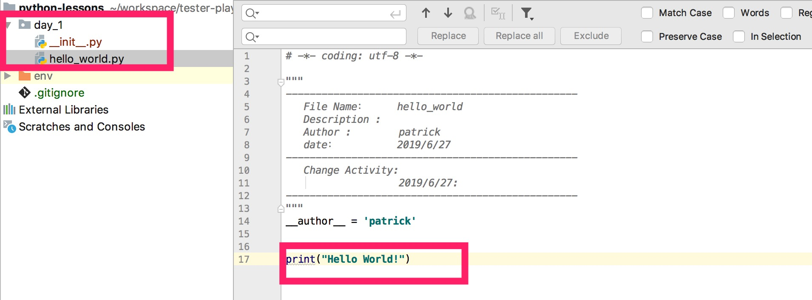
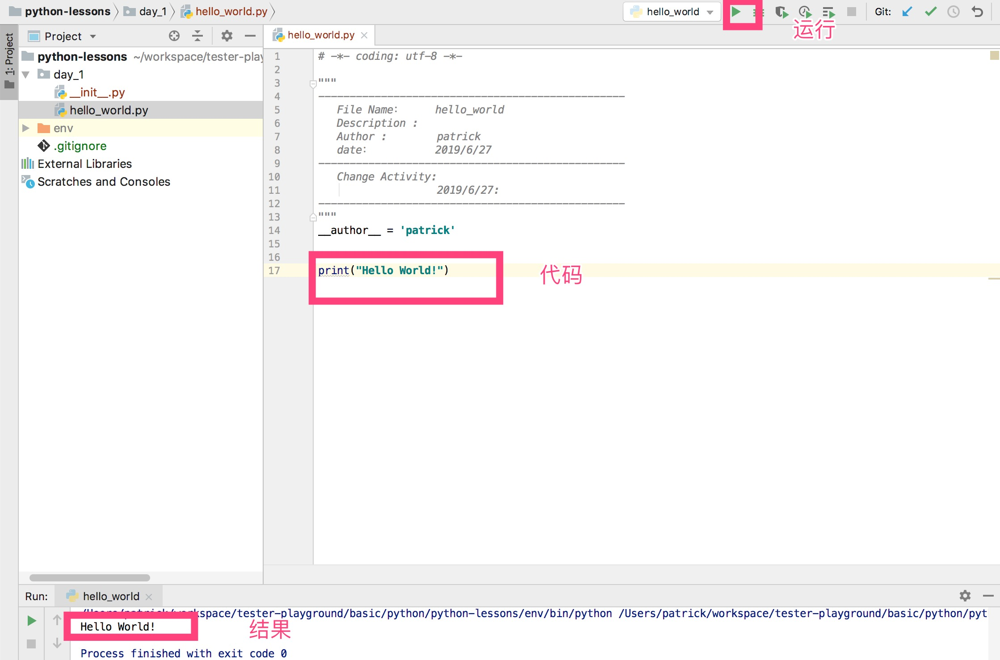

# 学习Python准备

Python是一门编程语言，简单而且强大.一些详细的介绍这边先省略.
教程更加注重实际的操作和问题的解决. 本篇主要介绍如何构建Python的开发环境.主要分为下面几个步骤:

- 安装Python3
- 安装Python3 的IDE: PyCharm/VisualStudio Code
- Python3虚拟环境配置介绍
- 运行第一个Python程序: HelloWorld

---

## 1. 安装Python3

Python3的安装非常简单,直接下载Python3安装包，运行安装就可以.
[Python3下载地址](https://www.python.org/downloads/)

下载Python3,需要验证Python3是否安装成功？验证方法如下:

** Windows下面开启CMD，MAC或者Linux下面开始终端，输入python**：

```sh
patrick@pwlocal ~ $ python                                                                         [ruby-2.4.1]
Python 3.7.1 (default, Dec 14 2018, 13:28:58)
[Clang 4.0.1 (tags/RELEASE_401/final)] :: Anaconda, Inc. on darwin
Type "help", "copyright", "credits" or "license" for more information.
>>>
```

如果显示中有```Python 3.X.X```字样，标示Python3安装成功了.
如果不能正常现实Python3，那么标示Python3的环境还没有配置成功.

- Window下需要额外配置讲Python3配置到Window的运行环境中
- MAC/Linux 需要讲Python3加入到PATH目录下面,或者讲```/usr/bin```下面的Python的软连接指向Python3

## 2.安装Python3的IDE

IDE的意思就是集成开发环境工具，可以在这个工具中编写Python程序非常方便.需要强调的功能主要为:
- 代码自动提示补全
- 自动跳转
- 代码运行/Debug
- ......

### 2.1 安装Pycharm

[pycharm](https://www.jetbrains.com/pycharm/download/)下载地址. pycharm 有两个版本:
- 社区版 - 免费
- 专业版 - 收费

按照安装指引安装好之后，我们可以打开pycharm，创建第一个python项目,如下图所示:


以下针对图示是一些说明:
1. 从创建pure python项目开始
2. 选择好项目保存在本地硬盘的地址
3. 选择创建一个虚拟python环境

## 3. Python 虚拟环境

由于python装在系统目录下面，为了防止和系统安装的包出现冲突，Python项目推荐使用一个虚拟Python环境，主要好处如下:
- 和系统的Python环境隔离
- 可以管理好该项目所有的第三方包的依赖
- 切换到其他机器上运行是只需要同样创建Python的虚拟环境，安装项目依赖就可以运行,隔离了操作系统层

详细关于Python虚拟环境会在实际项目中再详细介绍.

## 4. 运行第一个HelloWorld程序

创建好项目后，我们常见一个python package： day_1,然后在这个package下面创建好helloworld.py,也就是我们的第一个程序: HelloWorld.



代码如下:

```python
print("Hello World!"
```

在pycharm中运行程序就可以:


### 4.1 使用命令行运行python

这个例子中还可以使用命令行运行python:

```sh
python hello_world.py
```

运行结果如下:

```sh
(env) ~/day_1$ python hello_world.py
Hello World!
```
