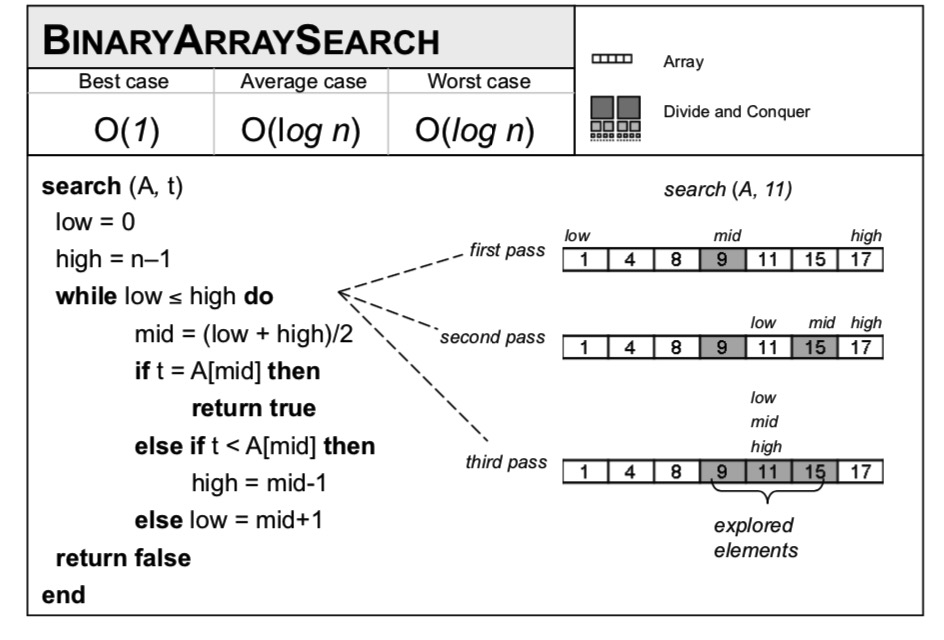
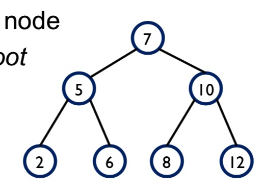
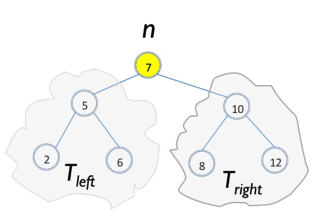

# Binary Search

## 问题描述

查看一个集合中是否包含一个特定元素
- 集合： python list
- python in statement
- 性能如何

## Python in 实现

```python 
def contains(collection, target):
    return target in collection
```

- 最好：第一个找到
- 最差：最后一个找到
- 平均：检查1/2的元素

有没有更好的解法？

## BinaryArraySearch 

伪代码: 必须是排序的集合

```python
search(A,t):
  low=0
  high=n-1
  while low<=high do
    mid=(low+high)/2
    if t= A[mid] then
        return true
    else if t<A[mid] then
        high = mid-1
    else 
        low = mid+1

```

|

## Binary Tree Structure

递归数据结构

- 值
- 左节点
- 右节点
- 最顶端是根节点



二叉树特点：
- 左节点值小于父节点值
- 右节点值大于父节点值


## 二叉树使用和可能的问题

- 什么时候使用
  * 数据量未知
  * 数据变化多，插入和删除多
- 存在问题
  * 不平衡