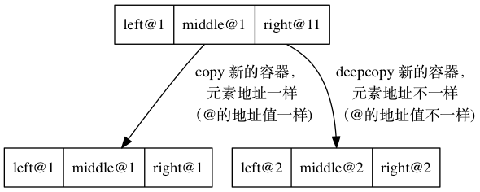

# Python Module - Copy

copy module 还是比较重要的一个概念，copy中主要是两个函数：

- copy()
- deepcopy()

两者的区别如下图：

## copy()

copy 这个函数实际上是创建了一个新的容器，但是容器里面的元素都指向相同的地址(reference).

参考下例：

```Python
class TestClass:
    def __init__(self, name):
        self.name = name
    # 重写等于
    def __eq__(self, other):
        return self.name == other.name
    # 重写大于
    def __gt__(self, other):
        return self.name > other.name


a = TestClass('a')
my_list = [a]
dup = copy.copy(my_list)

print('             my_list:', my_list)
print('                 dup:', dup)
print('      dup is my_list:', (dup is my_list))
print('      dup == my_list:', (dup == my_list))
print('dup[0] is my_list[0]:', (dup[0] is my_list[0]))
print('dup[0] == my_list[0]:', (dup[0] == my_list[0]))
```

结果：

```Python
             my_list: [<__main__.MyClass object at 0x102177e10>]
                 dup: [<__main__.MyClass object at 0x102177e10>]
      dup is my_list: False
      dup == my_list: True
dup[0] is my_list[0]: True 
dup[0] == my_list[0]: True
```

从结果可以看到：

1. ```up is my_list: False```

实际上这个是表示不同的容器，但是容器（list）的值还是相等的

2. ```dup[0] is my_list[0]: True```

容器里面的元素是一样的，还是指向了同一个地方

## deepcopy()

deepcopy的话，不只容器copy，里面的元素也会copy，元素也是指向不同的地址，参考如下：


```Python

class TestClass:
    def __init__(self, name):
        self.name = name

    def __eq__(self, other):
        return self.name == other.name

    def __gt__(self, other):
        return self.name > other.name


a = TestClass('a')
my_list = [a]
dup = copy.deepcopy(my_list)

print('             my_list:', my_list)
print('                 dup:', dup)
print('      dup is my_list:', (dup is my_list))
print('      dup == my_list:', (dup == my_list))
print('dup[0] is my_list[0]:', (dup[0] is my_list[0]))
print('dup[0] == my_list[0]:', (dup[0] == my_list[0]))
```

结果：

```python

             my_list: [<__main__.TestClass object at 0x10670ba90>]
                 dup: [<__main__.TestClass object at 0x1068017f0>]
      dup is my_list: False
      dup == my_list: True
dup[0] is my_list[0]: False
dup[0] == my_list[0]: True
    
```

从结果看：
1. ```up is my_list: False```

实际上这个是表示不同的容器，但是容器（list）的值还是相等的 

2. ```dup[0] is my_list[0]: False```

容器里面的元素也变成不一样的，指向了不同的内存地址，但是容器（list）的值还是相等的