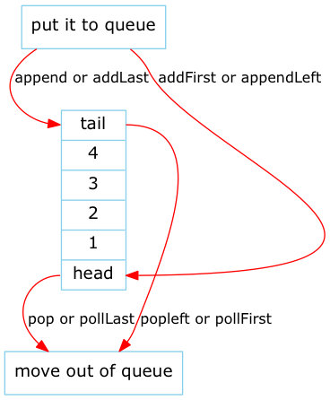

# Python Module - deque

关于Deque的一些说法：

From Wiki:

```
In computer science, a double-ended queue
(dequeue, often abbreviated to deque)
is an abstract data type that generalizes a queue,
for which elements can be added to or removed from
either the front (head) or back (tail).
[1] It is also often called a head-tail linked list,
 though properly this refers to a specific data
 structure implementation of a deque.
```

From JDK docs:

```
The name deque is short for "double ended queue" and is usually pronounced "deck"
```

## deque 常用的方法

|Operation|common names|java|python|javascript|
|---------|------------|----|------|----------|
|Insert at back|inject,snoc|offerLast|append|push|
|Insert at front|push,cons|offerFirst|appendleft|unshift|
|remove last element|eject|pollLast|pop|pop|
|remove first element|eject|pollLast|popleft|shift|
|Examine last element|peekLast|<obj>[-1]|<obj>[obj.length-1]|
|Examine first element|peekFirst|<obj>[-1]|<obj>[obj.length-1]|



## deque, and get element in Python

```python
d = collections.deque('abcdefg')
print('Deque:', d)
print('Length:', len(d))
print('Left end:', d[0])
print('Right end:', d[-1])
```

## remove and extendleft

- remove element
- add element in first in deque

```python
 d.remove('c')
print('remove(c):', d)
d.append("h")
print("append h into right:", d)

d.extendleft(range(5))
print("append into left:", d)
print(d)
d2 = collections.deque(d)
print(d2)
```

## difference between pop and popleft

pop 从最后一个开始移除元素，popleft则相反，详细参考下例：

```python
d.extendleft(range(5))
print("append into left:", d)
print(d)
d2 = collections.deque(d)
print(d2)
print(d2 is d)
print("pop, from end to top, vise popleft from top to end")
while True:
    try:
        print(d.pop(), end="\n")
    except IndexError:
        break
print(d)

print("popleft from top to end")
while True:
    try:
        print(d2.popleft(), end="\n")
    except IndexError:
        break
print(d2)
print("end of pop, from end to top, vise popleft from top to end")

```
