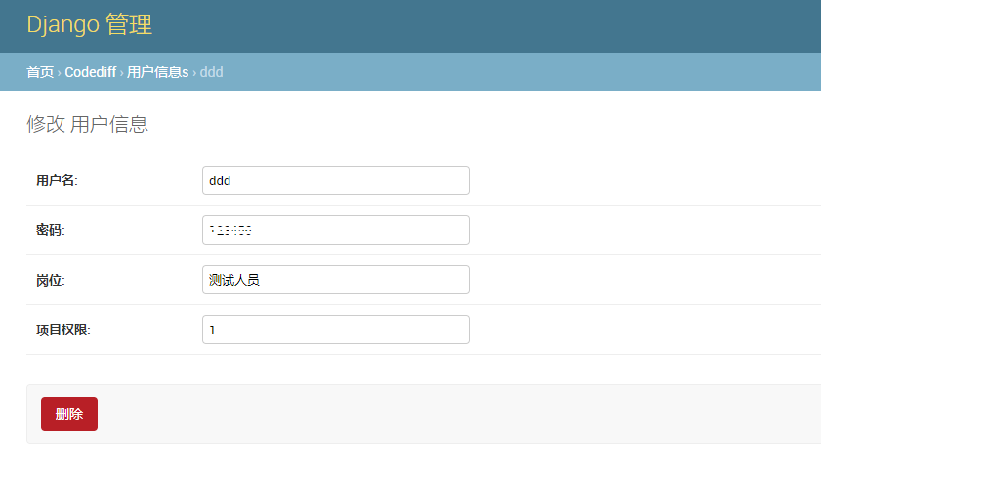
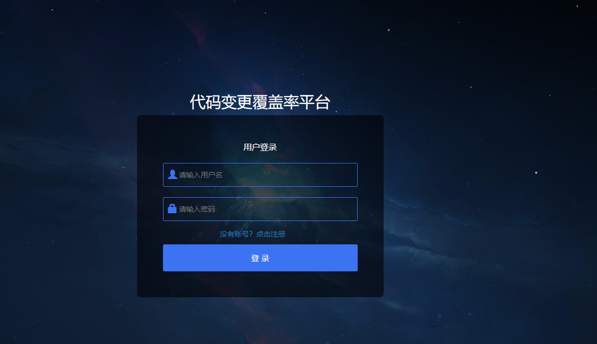
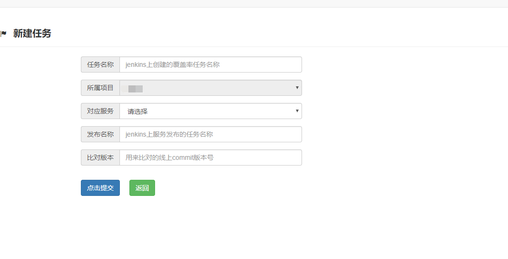

# DiffTestPlatform

### Key Features
***
- 项目管理：后台对项目增删改操作，前台列表展示
- 服务管理：后台对服务增删改操作，前台支持筛选展示对应服务的任务
- 任务管理：支持对覆盖率任务增删改查操作
- 版本比对：支持通过给出版本号或者通过“HEAD~1”方式描述回退版本数来指定与当前版本比对的版本
- 覆盖率数据：手动触发获取对应服务的覆盖率数据，统计服务下所有包及类的变更代码覆盖率统计数据
- 覆盖率详情：查看指定类文件的覆盖率详情，基于jacoco的覆盖率报告，显示规则基本一致，唯一区别对不属于变更的代码不会有底色显示
- 权限管理：后台对账号控制项目权限，来控制对应人员只能看到制定的项目情况

### 版本要求
***
python：3.4以上，建议3.6  
mysql：5.7以上

### 本地环境部署
***
1.安装mysql数据库服务端,并设置为utf-8编码，创建相应difftest数据库，设置好相应用户名、密码，启动mysql  
2.修改：DiffTestPlatform/DiffTestPlatform/setting.py里DATABASE的配置  
```
DATABASES = {
    'default': {
        'ENGINE': 'django.db.backends.mysql',
        'HOST': '127.0.0.1',  #数据库所在服务器的ip地址
        'PORT': '3306',   #监听端口 默认3306即可
        'NAME': 'difftest',  #新建数据库名
        'USER': 'root',   #数据库登录名
        'PASSWORD': '123456',   #数据库登录密码
        'OPTIONS': {
            'init_command': "SET sql_mode='STRICT_TRANS_TABLES'",
        },
    }
}
```  
3.命令行窗口执行pip install -r requirements.txt 安装工程所依赖的库文件  
4.命令行窗口切换到根目录 生成数据库迁移脚本,并生成表结构
```
python manage.py makemigrations CodeDiff #生成数据迁移脚本
python manage.py migrate  #应用到db生成数据表
```
5.创建超级用户，用户后台管理数据库，并按提示输入相应用户名，密码，邮箱。
```
python manage.py createsuperuser
```
6.启动服务
```
python manage.py runserver 0.0.0.0:8000  #本地环境启动可以配置0.0.0.0，如果是正式环境需要配置访问ip
```

### 使用手册
***
1.浏览器输入：http://127.0.0.1:8000/register 注册用户,注册完成后会提示需要在管理后台配置权限  
  
2.浏览器输入：http://127.0.0.1:8000/admin 创建项目、服务，并将注册用户关联项目权限  
  
3.浏览器输入：http://127.0.0.1:8000 登录用户  
  
4.进入首页，左侧为项目列表（项目为后台创建，受用户权限控制），可以通过服务名称进行查询（服务为后台创建），首页展示符合条的任务信息。可以对任务进行编辑、删除和触发操作  
  
5.点击新增任务，进入新建任务页面。任务名称为jenkins上创建的覆盖率任务的名称。发布名称为jenkins上服务发布的任务名称，比对版本为git上对应的版本的commit版本号。  
  
6.点击对应任务的触发按钮，触发对应服务的代码变更覆盖率统计  

7.点击对应类名，进入对应类的代码覆盖率报告详情。（该报告基于jacoco的全量覆盖率报告，针对变更代码进行映射，非变更代码无底色显示）  
